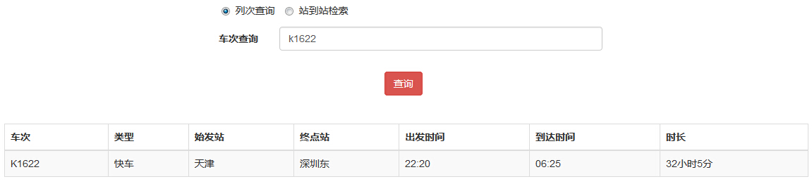
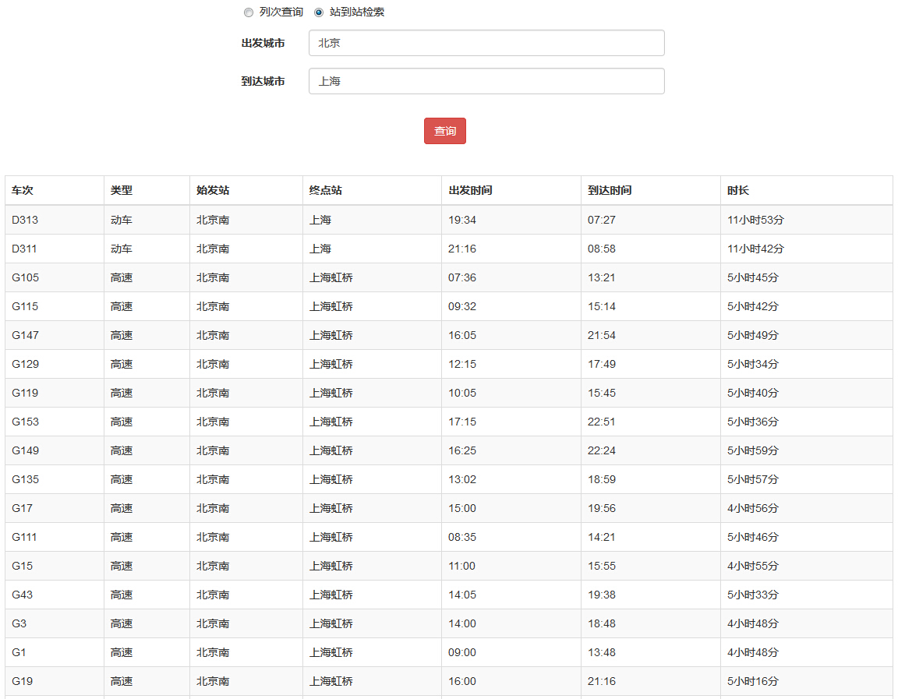

#PHP模拟火车票查询功能

- **data1.json：提供参考的json数据字段**
- **train.php：查询界面**

>核心技术：PHP、ajax、jQuery、bootstrap、json


###train.php
```php
		<div class="container">
		<div class="row">
			<div class="col-md-6 col-md-offset-3">
				<form class="form-horizontal" action="http://op.juhe.cn/onebox/train/query_ab" method="get">
					<div class="col-sm-10 ">
						<label class="radio-inline">
						  <input type="radio" id="inlineCheckbox1" name="select" value="option1" checked>列次查询
						</label>
						<label class="radio-inline">
						  <input type="radio" id="inlineCheckbox2" name="select" value="option2">站到站检索
						</label>
					</div>
					<br><br>
					<div class="form-group dis1">
						<label for="from"  class="col-sm-2 control-label">车次查询</label>
						 <div class="col-sm-10">
						<input type="text" class="form-control" id="train" name="train" placeholder="请输入列车车次号">
						</div>
					  </div>
					  <div class="form-group dis">
						<label for="from" class="col-sm-2 control-label">出发城市</label>
						<div class="col-sm-10">
						<input type="text" class="form-control" id="from" name="from" placeholder="请输入出发城市">
						</div>
					  </div>
					  <div class="form-group dis">
						<label for="to"  class="col-sm-2 control-label">到达城市</label>
						<div class="col-sm-10">
						<input type="text" class="form-control" id="to" name="to" placeholder="请输入到达城市">
						</div>
					  </div>
					   <div class="form-group">
						<input type="hidden" class="form-control" id="key" name="key" value="c60b814c7f010153b4c568f63f7c92b8">
					  </div>
					  <div class="col-sm-2 col-md-offset-5">
					  	<button type="submit" id="submit" name="submit" class="btn btn-danger">查询</button>
					  </div>	
					  
				</form>
			</div>
			<div class="col-md-1"></div>
		</div>
		<br><br>
		<div class="row">
			<div class="col-md-12" id="result">
				
			</div>
		</div>
	</div>
```
###ajax请求核心代码
```php

		$(function(){
			//$(".dis").css("display","none");
			$("#inlineCheckbox1").click(function(){
						$(".dis1").css("display","block");
						$(".dis").css("display","none");
						$("#from").val("");
						$("#to").val("");
				});
			$("#inlineCheckbox1").trigger('click');
			$("input[type='radio']").click(function(){
				if($("#inlineCheckbox1").is(":checked")){
						$(".dis1").css("display","block");
						$(".dis").css("display","none");
						$("#from").val("");
						$("#to").val("");
						//address='http://op.juhe.cn/onebox/train/query?train='+$("#train").val()+'&key='+$("#key").val();
					}else if($("#inlineCheckbox2").is(":checked")){
						$(".dis1").css("display","none");
						$(".dis").css("display","block");
						$("#train").val("");
						//address='http://op.juhe.cn/onebox/train/query_ab?train='+$("#train").val()+'&from='+$("#from").val()+'&to='+$("#to").val()+'&key='+$("#key").val();
						}
				})
			$("#submit").click(function(){
				
					var address;
					if($("#inlineCheckbox1").is(":checked")){
						address='http://op.juhe.cn/onebox/train/query?train='+$("#train").val()+'&key='+$("#key").val();
					}else if($("#inlineCheckbox2").is(":checked")){
						address='http://op.juhe.cn/onebox/train/query_ab?from='+$("#from").val()+'&to='+$("#to").val()+'&key='+$("#key").val();
						}
					//定义一个变量，根据radio的checked属性来给变量address赋值，接在把它赋值给ajax的url
				
				var ajaxTimeoutTest =$.ajax({
					url:address,
					type:'get',
					timeout:2000,
					dataType:'JSONP',
					beforeSend: function(){
						$("#result").html("<div class='mask'></div>")
						
						},
					success:function(result){
						//var ad='http://op.juhe.cn/onebox/train/query?train='+$("#train").val()+'&key='+$("#key").val();
						//alert(address);
						var arr=result.result.list;
						var data='<table class="table table-bordered table-striped table-hover">'+'<thead>'+'<tr>'+'<th>车次</th>'+'<th>类型</th>'+'<th>始发站</th>'+'<th>终点站</th>'+' <th>出发时间</th>'+' <th>到达时间</th>'+'<th>时长</th>'+'</tr>'+'</thead>'+'<tbody>';
						
						var pattern=/query_ab/i;
						var pan=pattern.test(address);
						//根据车次查询的特有字段'auery_ab'来匹配政策表达式，如果包含，返回true；否则返回false；进而得出展示哪些数据需要被渲染
						if(pan==true){
							for(var i=0;i<arr.length;i++){
								data+='<tr>';
								for(j in arr[i]){
									if(j=='m_train_url' | j=='start_station_type' | j=='end_station_type' | j=='run_distance' | j=='m_chaxun_url' | j=='price_list') continue;
										data+='<td>'+arr[i][j]+'</td>'
									}
								data+='</tr>';
									
								}
							
						}else{
								data+='<tr>'
									+'<td>'+arr['train_no']+'</td>'
									+'<td>'+arr['train_type']+'</td>'
									+'<td>'+arr['start_station']+'</td>'
									+'<td>'+arr['end_station']+'</td>'
									+'<td>'+arr['start_time']+'</td>'
									+'<td>'+arr['end_time']+'</td>'
									+'<td>'+arr['run_time']+'</td>'
								'</tr>';
							}
								
		
							data+='</tbody>';
							data+='</table>';	
						$("#result").html(data);
						},
					/*error:function(){
						$("#result").html("对不起,请求失败啦");
						},*/
					error:function(XMLHttpRequest,status){
						if(status=='timeout'){
							//ajaxTimeoutTest.absort();
							$("#result").html("查询失败");
							}
						
						}
					})
				return false;
				})
			})
	
```

###效果图



